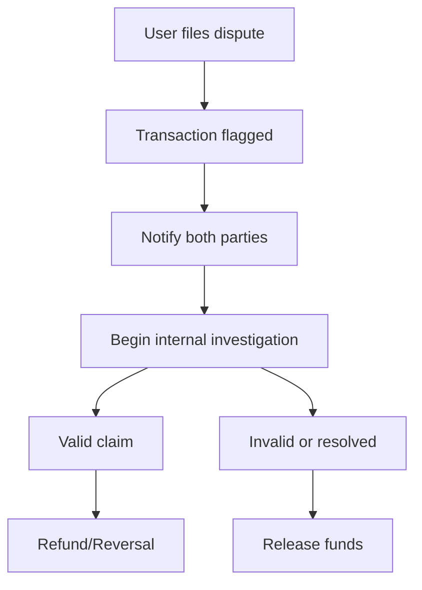

---
# You can also start simply with 'default'
theme: seriph
# random image from a curated Unsplash collection by Anthony
# like them? see https://unsplash.com/collections/94734566/slidev
background: https://cover.sli.dev
# some information about your slides (markdown enabled)
title: Welcome to Slidev
info: |
  ## Slidev Starter Template
  Presentation slides for developers.

  Learn more at [Sli.dev](https://sli.dev)
# apply unocss classes to the current slide
class: text-center
# https://sli.dev/features/drawing
drawings:
  persist: false
# slide transition: https://sli.dev/guide/animations.html#slide-transitions
transition: slide-left
# enable MDC Syntax: https://sli.dev/features/mdc
mdc: true
---

<h1 style="text-align: center">LETVANA Rent Smarter, Live Better</h1>

### Brand & Product Strategy Overview  

**Date:** May 2025

  <b>Prepared by:</b> Althub Team 33 <carbon:arrow-right />

  <button @click="$slidev.nav.openInEditor" title="Open in Editor" class="slidev-icon-btn">
    <carbon:edit />
  </button>
  <a href="https://github.com/slidevjs/slidev" target="_blank" class="slidev-icon-btn">
    <carbon:logo-github />
  </a>

<!--
The last comment block of each slide will be treated as slide notes. It will be visible and editable in Presenter Mode along with the slide. [Read more in the docs](https://sli.dev/guide/syntax.html#notes)
-->
---
transition: fade-out
layout: image-right
image: https://img.freepik.com/free-photo/aerial-shot-colorful-buildings-surrounded-by-trees_181624-55147.jpg?uid=R80293182&ga=GA1.1.394281939.1719824985&semt=ais_hybrid&w=740
---

 
 
 

# Problem Statement

Despite the existence of rental hubs in the market, renters still experience issues such as unreliable property information, scam, limited transparency around payments and agreements, no centralized digital hub to manage tenant–landlord relationships and agent monopoly. 

This project seeks to address these pain points by creating a user-centered rental platform.

<!--
You can have `style` tag in markdown to override the style for the current page.
Learn more: https://sli.dev/features/slide-scope-style
-->

---
transition: fade-out
---

# Solution

Build, grow and monetize a digital rental platform that simplifies renting for both tenants and landlords

LETVANA addresses these issues through:

- ✅	Verified Listings Only – eliminates fraud and builds trust.
- ✅	In-App Secure Payments – enables digital, traceable rent transactions.
- ✅	Tenant-Landlord Chat – streamlines communication and negotiations.
- ✅	Referral and Loyalty System – incentivizes growth via word-of-mouth.
- 🔒	Maintenance Support & Escrow System – resolves issues efficiently and ensures fairnes.

 

<!--
Here is another comment.
-->

---
transition: fade-out
---

# Brand Identity

- Rendered in Satoshi Bold, the name ***“Letvana”*** appears clean and strong. The capital ***L*** gives the name presence, while the rest of the letters maintain a friendly and approachable tone. The unique fusion of Let which means ***"To Let”*** and Nirvana which means ***“a state of liberation and freedom from suffering”*** (which inspired the name) is reflected in the calm authority of the typography. 

**Core Values:**
- Trust: We ensure all listings are verified and secure to build user confidence.
- Simplicity: We create a seamless rental journey from discovery to payment.
- Transparency: No hidden fees or deceptive listings, what you see is what you get.
- Empowerment: We equip tenants and landlords with tools and data to make informed decisions.
- Innovation: We continuously improve through data-driven iterations and customer feedback.

<!--
Here is another comment.
-->

---
transition: slide-up
---

# Brand Voice, Tone & Personality

**Voice:** Friendly, Transparent, Trustworthy

**Tone:**
- Professional yet relatable
- Warm & Empowering in user communication.
- Professional & Precise for B2B/landlord messaging.

**Positioning:** A trusted, tech-first housing rental platform built for Nigerians.

**Personality:**  Smart, Trustworthy & Approachable

> **Mission:** To empower urban Nigerians to rent with confidence by providing a safe, transparent, and fully digital housing experience that eliminates fraud, simplifies processes, and enhances tenant-landlord trust.

 

> **Vision:** To become Nigeria’s most trusted rental platform, redefining how people discover, pay for, and live in rented spaces—digitally, securely, and seamlessly.

<!--
Here is another comment.
-->

---
transition: slide-left
level: 2
---

# Visual Identity & Design

  <!-- Keep weight usage consistent across all brand touchpoints. -->

---

---
transition: slide-down
level: 2
---

# Business Opportunity

- Rental Transaction Commission: Charge a percentage of each rent payment (e.g. 5–10%). This aligns with the legal 10%.
- Listing Fees & Subscriptions: Landlords/agents can pay for featured listings or subscribe for multiple property management tools.
- Payment Service Fee: A small fee (e.g. 2–5%) on processed rent transactions, similar to Lagos’s planned 5% digital rent fee.
- Value-Added Services: Revenue share from optional services like rent insurance, tenant screening, furniture rental partnerships.
- Data & Analytics: Sell anonymized rental market insights (price trends, vacancy rates) to developers and local agencies.

---

| Source  |         Rate      |     Example        |
|----------------------|--------------------------------|---------------------------------|
| **Commission**       | 5% on transaction              | 50k on 500k rent                |
| **Featured Listing** | 2k to 5k weekly                | Landlord Visibility             |
| **Service Fee**      | 2% to 3% on digital payments   | Flutterwave or Paystack         |
| **Ad Placement**     | 1k to 3k per click             | Big Brands                      |

 

-	5–10% commission on verified rent transactions
-	Listing fees + premium placement
-	Value-add partnerships: Rent insurance, deposit escrow, ID verification
-	Sell Data + analytics for landlords and institutions

---

 
 

## Target Audience
Urban renters in Lagos

 

TAM: Lagos (21M people, 98% renting  has 6–8M households. At an average rent of ₦1M/yr, the total Lagos rental market could be ₦6–8 trillion (15–20B) annually.

SAM: Focus on Lagos city (smartphone users, formal housing) 50% of TAM (3–4M households). 
Initial target: renters in key corridors (Yaba, Surulere, Ikeja, Lekki).

SOM:  A realistic 3–5% share in 5 years (100k–200k leases/yr). At ₦500k average annual rent and 5% commission, this is ₦2.5–5B in annual revenue potential.

---
class: text-justify text-left
transition: slide-up
level: 2
---

# The Market

-	**Target Audience:** Urban renters in Lagos
-	**Students: 18 - 25:** They Seek affordable shared or single rooms near campuses. They prioritize low cost, furnished units, Wi-Fi and flexible short leases (often paying monthly due to tight budgets)
-	**Young Couples:** 25 - 35  Mostly Want 1-2 bedroom apartments in safe, amenity-rich neighborhoods (schools, markets, transit). They value transparent pricing (no hidden agent fees) and more manageable payment schedules
-	**Young Professionals:** 35 - 55 Such as Bankers, tech and oil workers. They seek quality apartments and often favor fully furnished or service units. Some needs corporate short term let. They expect dependable landlords and value digital contract or reciept for compliance.

**User Stories**
We developed Letvana listening to real frustrations. Here are the authentic pain points we address:

---

## 1. The Tenant's Frustration

 

> “I don't want the hassles of multiple agent appointments or dealing with half-truths.  
> I want to search directly for properties.”

 

> “I don't want agents hustling me on charges I'm unsure about.  
> I want the truth directly from the Landlord, minus the fee.”

 

## 2. The Landlord's Burden:

 

>"I'm tired of being misrepresented by agents regarding information, payments, and fees."
>"I'm tired of agents inflating fees, creating bottlenecks that stop renters from occupying my property."

 

## 3. The Letvana Promise:

- Verify users with ID and phone/email validation.
- Ensure secure payment integration for both parties.

---
transition: slide-up
layout: image-left
image: https://img.freepik.com/free-photo/male-employee-getting-used-his-new-office-job-along-with-female-colleagues_23-2149034604.jpg?uid=R80293182&ga=GA1.1.394281939.1719824985&semt=ais_hybrid&w=740
level: 2
---

# User Personas

### 1. Kelechi (25), NYSC Member
-	**Needs:** Affordable, secure rental
-	**Frustrations:** Scam agents, delays
-	**Goal:** Trustworthy and fast rental

 

### 2. Amaka (43), Working Mother
-	**Needs:** Child-friendly neighbourhood
-	**Frustrations:** Lack of verified options
-	**Goal:** Quick move-in, stress-free process

 

### 3. Tobi (35), Remote Worker
-	**Needs:** Quiet, serviced apartment
-	**Frustrations:** Poor listing quality
-	**Goal:** Book online, pay digitally

---

 
 
 
 

**TAM:** Lagos (21M people, 98% renting  has  6–8M households. At an average rent of ₦1M/yr, the total Lagos rental market could be ₦6–8 trillion ($15–20B) annually.

**SAM:** Focus on Lagos city (smartphone users, formal housing) 50% of TAM (3–4M households). 
Initial target: renters in key corridors (Yaba, Surulere, Ikeja, Lekki).

**SOM:**  A realistic 3–5% share in 5 years (100k–200k leases/yr). At ₦500k average annual rent and 5% commission, this is ₦2.5–5B in annual revenue potential.

---
transition: slide-up
layout: image-right
image: https://img.freepik.com/free-photo/3d-smartphone-device-with-map-gps-technology_23-2150458977.jpg?uid=R80293182&ga=GA1.1.394281939.1719824985&semt=ais_hybrid&w=740
level: 2
---

 
 
 

# Product Roadmap (June – Oct 2025)

1. **June:** User Research, Personas, Wireframes
2. **July – Aug:** Development of MVP Features (Auth, Listings, Chat, Payments)
3. **Sept – Mid-Oct:** QA, User Testing, Iteration
4. **Late Oct:** Final Demo & Graduation

---
transition: slide-up
layout: image-left
level: 2
---

 

# Internal Timelines by Sprint

1. **Sprint 1–2 (June):** Research, Personas, Prototypes
2. **Sprint 3–6 (July–Aug):** Frontend + Backend Dev, Payment Integration, Referrals, Analytics
3. **Sprint 7–10 (Aug–Oct):** Testing, Bug Fixes, Live Demos
4. **Sprint 11–12 (Oct):** Final Presentation & Graduation Prep

---
transition: slide-left
level: 2
---

# Key Feature Coverage

 

### Key Features (MVP)

-	User registration/login
-	Smart property search with filters, location, price, types e.t.c
-	Verified listings with Photos, Videos & Walk-In Inspection 
-	Online viewing
-	User Profile 
-	Contact form or direct chat between tenants and landlord/agents
-	Digital rent payment with receipts & history 
-	Save favorites listings and get alerts for new listings
-	Verified property badge
-	Tenant screening & ID verification 
-	Map view (optional for MVP)

---

## Features Requirements	

| S/N | Feature            |  Description       | Priority |
|-----|--------------------------|--------------------------------------------------------------|--------------|
| 1   | Property Search         | Keyword/location-based search with filters                   | High         |
| 2   | Verified Listings       | Landlord ID verification and listing approval                | High         |
| 3   | In-App Messaging        | Real-time chat between tenants and landlords                 | High         |
| 4   | Digital Rent Payment    | Paystack/Flutterwave integration with receipts & tracking    | High         |
| 5   | Listing Management      | Dashboard for landlords to add/edit/delete property          | High         |
| 6   | User Profiles           | Editable profiles for both tenants and landlords             | Medium       |
| 7   | Notifications           | Real-time alerts for new messages, rent due, etc.            | Medium       |

---

## Prioritization (MoSCoW)

| S/N | Must-Have        |  Should-Have   | Could-Have | | Won't-Have |
|-----|--------------------------|-----------------------------------------------------------|--------------|----------------|--------------|
| 1   | Listings, Payments, In-App Message   | E-Sign Contracts                   | Map View       | | Virtual Tours        | 
| 2   | Referral System       | Maintenance Module                | Multilingual UI        ||Crypto Payments        |

 

### Operations & Support
Customer Support
In-app Chat: 24/7  
Email: support@letvana.com  
Service Level Agreement (SLA): Response Time - 3hrs. Resolution Time - 24hrs

-	Onboarding - Tenants & Landlords
-	Digital ID Verification (NIN/BVN/International Passport)
-	Training Resources (Video & FAQ)
-	Self-Serve Dashboard

---
transition: slide-up
level: 2
---

# Metrics for Success

### Forecasted KPIs & Metrics

-	User Adoption: Track registered tenants and landlords. Goal: 1k+ users by end of AUGUST|SEPTEMBER, 100k+ by Y3.
-	Listings: Aim for 200 active property listings by AUGUST|SEPTEMBER (covering all unit types), expanding to 5,000+ by Y3.
-	Engagement: Monitor lead-to-lease conversion (target 10–20%) and average time to lease completion. Aim to increase repeat usage (renewals or new rentals).
-	Revenue: Forecast based on commission: e.g. 500 leases in Y1 × ₦500k avg rent × 5% ≈ ₦12.5M, growing proportionally with users.
-	Retention & Costs: Measure churn rate, customer acquisition cost (CAC) and lifetime value (LTV). 
- Keep CAC < LTV to ensure scalable growth.

---
layout: full
---

---
layout: full
---

---
transition: slide-up
---

# Frontend Tech Stack for Letvana

| Layer               | Preferred Technologies             |
|---------------------|--------------------------------------|
| Frontend Framework  | React.js                             |
| Styling             | Tailwind CSS, Styled Components      |
| State Management    | React Context API, Redux Toolkit     |
| Routing             | React Router                         |
| Forms               | React Hook Form                      |
| HTTP Requests       | Axios                                |
| Authentication      | Firebase Authentication, Auth0       |
| Build Tools         | Vite, Create React App (CRA)         |
| Hosting             | Vercel, Firebase Hosting             |

---
transition: slide-left
---

# Backend Tech Stack

Core technologies

| Layer                           | Preferred Technologies         |
|----------------------------------|--------------------------------------|
| Programming Language            | JavaScript / TypeScript              |
| Framework                       | Node.js, Express.js                  |
| Database Management             | MySQL, MongoDB                       |
| Authentication & Authorization | JWT, Auth0, OAuth                    |
| Third-Party Integrations        | PipeOps, Paystack                    |

## API Development and Framework

- **Node.js** enables seamless rental management by handling API interactions, database operations, real-time updates, secure payments, and user authentication efficiently.
- **Express.js** supports fast API development, making it easier to manage rental listings, bookings, and payments.
- Enables seamless integration of authentication, payment gateways, and database connections.
- Supports real-time features such as chat systems, rental availability updates, and notifications.
- Microservices-friendly architecture.

## Database Management

- **MySQL** stores user profiles, rental agreements, payment transactions, and booking history. Also handles user authentication and transaction data.
- **MongoDB** stores property listings, user reviews, and search history.

## Authentication and Authorization

- **JWT** manages authentication.
- **OAuth** allows secure logins via third-party platforms like Google.
- **Auth0** provides complete authentication and authorization services.

## Payment Processing

- **Paystack** enables local and international payments with fast settlements and security features for fraud prevention.

## Hosting Services

- **PipeOps** supports smooth application deployment.

---
transition: slide-up
---

# Cloud Infrastructure

For our primary infrastructure, we would be using **AWS.**  
Here are the key AWS components for our project.

| Layer              | Preferred AWS Services                           |
|--------------------|--------------------------------------------------|
| Frontend hosting   | AWS Amplify (or S3 + CloudFront)                 |
| Backend            | AWS Lambda + API Gateway                         |
| Database           | DynamoDB                                         |
| Authentication     | AWS Cognito                                      |
| Storage            | Amazon S3 (images, documents, etc.)              |
| Security           | IAM + Cognito + (optional KMS)                   |
| Monitoring         | CloudWatch                                       |
| Domain / DNS       | Route 53                                         |

---
transition: slide-left
---

# Security, Compliance and Privacy

## Action taken/Measures put in place
- Implementing multi-factor authentication (MFA)  
- Enforcing strong password policies to prevent weak credentials  
- Encrypt all personal data – at rest and in transit  

## GDPR/NDPR Compliance
- Collecting only necessary data  
- NDPR Specific requirement – Letvana is a Data Controller  
- Consent mechanism:  
  - Requesting consent from data subjects for processing of their data  
  - Having no pre-ticked boxes as required under GDPR  
  - Store the timestamp and IP address of consent  
  - Easy navigation to the privacy policy (the policy shows what data is collected, purpose of data collection, consent and user rights, data storage and retention etc.)  

## Data Security
We implement appropriate technical and organizational measures to protect your data:
- Encryption: Data is encrypted at rest using AES-256 and in transit using TLS 1.2+  
- Access Control: Only authorized personnel have access to sensitive data  
- Audit Logs: Activities are logged for security monitoring  

## Data Storage and Retention
We retain personal data:
- For active accounts: as long as your account is active  
- For inactive users: up to 24 months after last activity  
- For payment records: as required by financial regulations (typically 6 years)  
After the retention period, your data is securely deleted.

---
transition: slide-up
features:
mermaid: true
---

# Visual Workflow Diagram – Dispute Handling

---
transition: slide-left
layout: image-left
image: https://img.freepik.com/premium-photo/bungalow-exterior-view_2649-112.jpg?uid=R80293182&ga=GA1.1.394281939.1719824985&semt=ais_hybrid&w=740
level: 2
---

 
 
 
 

# Summary & Next Steps

- Finalize MVP Prototypes
-	Lock Dev & QA Sprints
-	Launch Waitlist Campaign
-	Begin Development – June 1, 2025
-	Target Demo – October 2025 Graduation

---
transition: slide-left
level: 2
---

# Contact & Credits

Email: support@letvana.com  
Website: www.letvana.com  
Telephone: +23401-234567890  
Althub Team 33

# Thank You