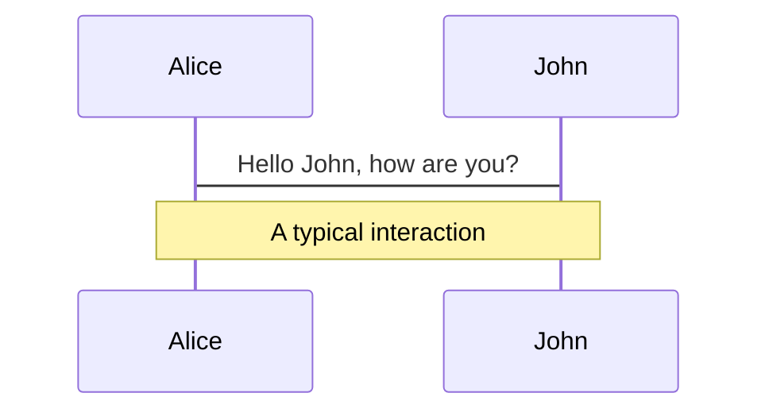
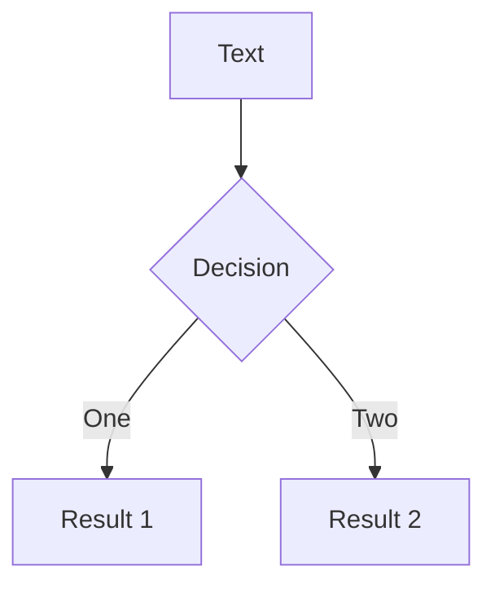
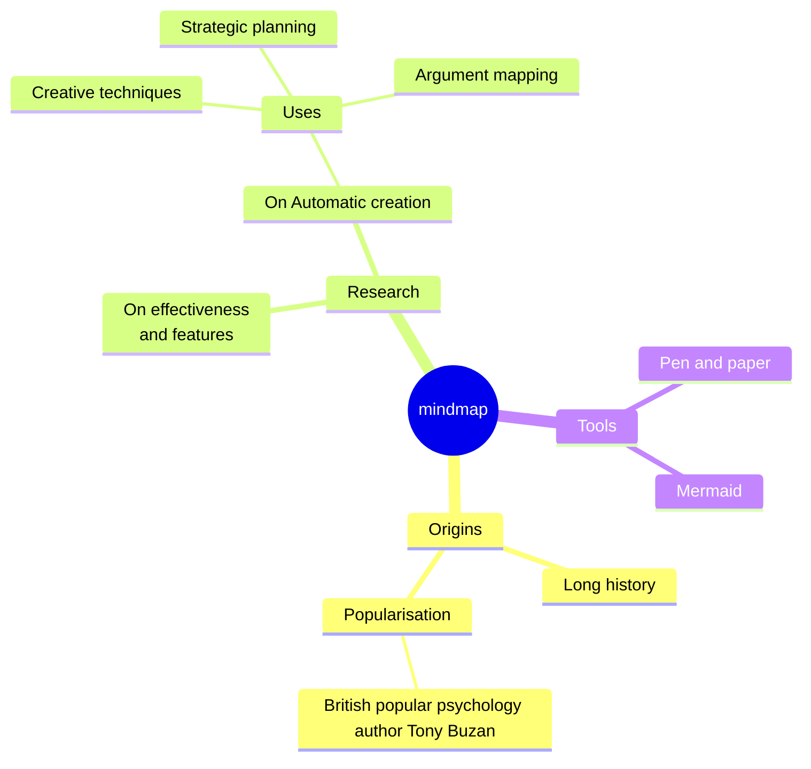
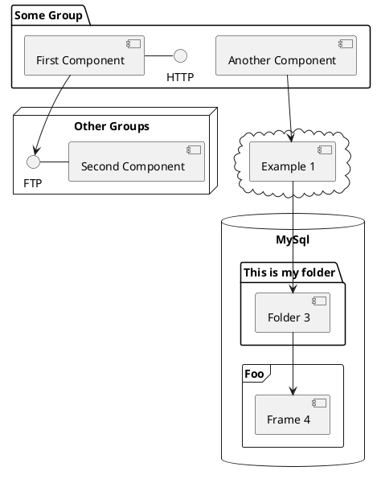

---
# You can also start simply with 'default'
theme: seriph
# random image from a curated Unsplash collection by Anthony
# like them? see https://unsplash.com/collections/94734566/slidev
background: https://cover.sli.dev
# some information about your slides (markdown enabled)
title: Welcome to Slidev
info: |
  ## Slidev Starter Template
  Presentation slides for developers.

  Learn more at [Sli.dev](https://sli.dev)
# apply unocss classes to the current slide
class: text-center
# https://sli.dev/features/drawing
drawings:
  persist: false
# slide transition: https://sli.dev/guide/animations.html#slide-transitions
transition: slide-left
# enable MDC Syntax: https://sli.dev/features/mdc
mdc: true
---

<h1 style="text-align: center">LETVANA <sup style="font-size: 0.5em; color: white;">Rent Smarter, Live Better</sup></h1>


### Brand & Product Strategy Overview  

**Date:** May 2025


<div @click="$slidev.nav.next" class="mt-12 py-1" hover:bg="white op-10">
  <b>Prepared by:</b> Althub Team 33 <carbon:arrow-right />
</div>

<div class="abs-br m-6 text-xl">
  <button @click="$slidev.nav.openInEditor" title="Open in Editor" class="slidev-icon-btn">
    <carbon:edit />
  </button>
  <a href="https://github.com/slidevjs/slidev" target="_blank" class="slidev-icon-btn">
    <carbon:logo-github />
  </a>
</div>

<!--
The last comment block of each slide will be treated as slide notes. It will be visible and editable in Presenter Mode along with the slide. [Read more in the docs](https://sli.dev/guide/syntax.html#notes)
-->
---
transition: fade-out
layout: image-right
image: https://cover.sli.dev
---

<br>
<br>
<br>

# Problem Statement

Despite the existence of rental hubs in the market, renters still experience issues such as unreliable property information, scam, limited transparency around payments and agreements, no centralized digital hub to manage tenant–landlord relationships and agent monopoly. 


This project seeks to address these pain points by creating a user-centered rental platform.

<!--
You can have `style` tag in markdown to override the style for the current page.
Learn more: https://sli.dev/features/slide-scope-style
-->

<style>
h1 {
  background-color: #2B90B6;
  background-image: linear-gradient(45deg, #4EC5D4 10%, #146b8c 20%);
  background-size: 100%;
  -webkit-background-clip: text;
  -moz-background-clip: text;
  -webkit-text-fill-color: transparent;
  -moz-text-fill-color: transparent;
}
</style>

---
transition: fade-out
---

# Solution

Build, grow and monetize a digital rental platform that simplifies renting for both tenants and landlords

LETVANA addresses these issues through:

- ✅	Verified Listings Only – eliminates fraud and builds trust.
- ✅	In-App Secure Payments – enables digital, traceable rent transactions.
- ✅	Tenant-Landlord Chat – streamlines communication and negotiations.
- ✅	Referral and Loyalty System – incentivizes growth via word-of-mouth.
- 🔒	Maintenance Support & Escrow System – resolves issues efficiently and ensures fairnes.

<br>


<style>
h1 {
  background-color: #7AC7C4;
  background-image: linear-gradient(45deg, #7AC7C4 10%, #223344 20%);
  background-size: 100%;
  -webkit-background-clip: text;
  -moz-background-clip: text;
  -webkit-text-fill-color: transparent;
  -moz-text-fill-color: transparent;
}
</style>

<!--
Here is another comment.
-->

---
transition: fade-out
---

# Brand Identity

- Rendered in Satoshi Bold, the name ***“Letvana”*** appears clean and strong. The capital ***L*** gives the name presence, while the rest of the letters maintain a friendly and approachable tone. The unique fusion of Let which means ***"To Let”*** and Nirvana which means ***“a state of liberation and freedom from suffering”*** (which inspired the name) is reflected in the calm authority of the typography. 

**Core Values:**
- Trust: We ensure all listings are verified and secure to build user confidence.
- Simplicity: We create a seamless rental journey from discovery to payment.
- Transparency: No hidden fees or deceptive listings, what you see is what you get.
- Empowerment: We equip tenants and landlords with tools and data to make informed decisions.
- Innovation: We continuously improve through data-driven iterations and customer feedback.


<style>
h1 {
  background-color: #2B90B6;
  background-image: linear-gradient(45deg, #4EC5D4 10%, #146b8c 20%);
  background-size: 100%;
  -webkit-background-clip: text;
  -moz-background-clip: text;
  -webkit-text-fill-color: transparent;
  -moz-text-fill-color: transparent;
}
</style>

<!--
Here is another comment.
-->


---
transition: slide-up
---

# Brand Voice, Tone & Personality

**Voice:** Friendly, Transparent, Trustworthy

**Tone:**
- Professional yet relatable
- Warm & Empowering in user communication.
- Professional & Precise for B2B/landlord messaging.

**Positioning:** A trusted, tech-first housing rental platform built for Nigerians.

**Personality:**  Smart, Trustworthy & Approachable

> **Mission:** To empower urban Nigerians to rent with confidence by providing a safe, transparent, and fully digital housing experience that eliminates fraud, simplifies processes, and enhances tenant-landlord trust.

<br>

> **Vision:** To become Nigeria’s most trusted rental platform, redefining how people discover, pay for, and live in rented spaces—digitally, securely, and seamlessly.


<style>
h1 {
  background-color: #2B90B6;
  background-image: linear-gradient(45deg, #4EC5D4 10%, #146b8c 20%);
  background-size: 100%;
  -webkit-background-clip: text;
  -moz-background-clip: text;
  -webkit-text-fill-color: transparent;
  -moz-text-fill-color: transparent;
}
</style>

<!--
Here is another comment.
-->

---
transition: slide-left
level: 2
---

# Visual Identity & Design

## Typography - Satoshi  
*Font Family*
### Font Weights to Use

| **Weight**       | **Use Case**                               |
|------------------|---------------------------------------------|
| **Bold (700)**   | Headlines, CTA buttons, key titles          |
| **Medium (500)** | Subheadings, menu items, card titles        |
| **Regular (400)**| Body text, descriptions, input labels       |
| **Light (300)**  | Footnotes, UI hints, muted text             |

<span class="text-sm text-gray-500">
  Keep weight usage consistent across all brand touchpoints.
</span>


<style>
h1 {
  background-color: #2B90B6;
  background-image: linear-gradient(45deg, #4EC5D4 10%, #146b8c 20%);
  background-size: 100%;
  -webkit-background-clip: text;
  -moz-background-clip: text;
  -webkit-text-fill-color: transparent;
  -moz-text-fill-color: transparent;
}
</style>

---


---
transition: slide-down
level: 2
---

# Business Opportunity

- Rental Transaction Commission: Charge a percentage of each rent payment (e.g. 5–10%). This aligns with the legal 10%.
- Listing Fees & Subscriptions: Landlords/agents can pay for featured listings or subscribe for multiple property management tools.
- Payment Service Fee: A small fee (e.g. 2–5%) on processed rent transactions, similar to Lagos’s planned 5% digital rent fee.
- Value-Added Services: Revenue share from optional services like rent insurance, tenant screening, furniture rental partnerships.
- Data & Analytics: Sell anonymized rental market insights (price trends, vacancy rates) to developers and local agencies.

<style>
h1 {
  background-color: #2B90B6;
  background-image: linear-gradient(45deg, #4EC5D4 10%, #146b8c 20%);
  background-size: 100%;
  -webkit-background-clip: text;
  -moz-background-clip: text;
  -webkit-text-fill-color: transparent;
  -moz-text-fill-color: transparent;
}
</style>

---

| <span>Source</span>  |         <span>Rate</span>      |     <span>Example</span>        |
|----------------------|--------------------------------|---------------------------------|
| **Commission**       | 5% on transaction              | 50k on 500k rent                |
| **Featured Listing** | 2k to 5k weekly                | Landlord Visibility             |
| **Service Fee**      | 2% to 3% on digital payments   | Flutterwave or Paystack         |
| **Ad Placement**     | 1k to 3k per click             | Big Brands                      |

<br>

-	5–10% commission on verified rent transactions
-	Listing fees + premium placement
-	Value-add partnerships: Rent insurance, deposit escrow, ID verification
-	Sell Data + analytics for landlords and institutions


<style>
span {
  font-weight: bold;
  background-color: #2B90B6;
  background-image: linear-gradient(45deg, #4EC5D4 10%, #146b8c 20%);
  background-size: 100%;
  -webkit-background-clip: text;
  -moz-background-clip: text;
  -webkit-text-fill-color: transparent;
  -moz-text-fill-color: transparent;
}
</style>

---

<br>
<br>

## Target Audience
Urban renters in Lagos

<br>

<span>TAM:</span> Lagos (21M people, 98% renting  has 6–8M households. At an average rent of ₦1M/yr, the total Lagos rental market could be ₦6–8 trillion (15–20B) annually.

<span>SAM:</span> Focus on Lagos city (smartphone users, formal housing) 50% of TAM (3–4M households). 
Initial target: renters in key corridors (Yaba, Surulere, Ikeja, Lekki).

<span>SOM:</span>  A realistic 3–5% share in 5 years (100k–200k leases/yr). At ₦500k average annual rent and 5% commission, this is ₦2.5–5B in annual revenue potential.

<style>
span, h2 {
  font-weight: bold;
  background-color: #2B90B6;
  background-image: linear-gradient(45deg, #4EC5D4 10%, #146b8c 20%);
  background-size: 100%;
  -webkit-background-clip: text;
  -moz-background-clip: text;
  -webkit-text-fill-color: transparent;
  -moz-text-fill-color: transparent;
}
</style>


---
class: text-justify text-left
transition: slide-up
level: 2
---

# The Market

-	**Target Audience:** Urban renters in Lagos
-	**Students: 18 - 25:** They Seek affordable shared or single rooms near campuses. They prioritize low cost, furnished units, Wi-Fi and flexible short leases (often paying monthly due to tight budgets)
-	**Young Couples:** 25 - 35  Mostly Want 1-2 bedroom apartments in safe, amenity-rich neighborhoods (schools, markets, transit). They value transparent pricing (no hidden agent fees) and more manageable payment schedules
-	**Young Professionals:** 35 - 55 Such as Bankers, tech and oil workers. They seek quality apartments and often favor fully furnished or service units. Some needs corporate short term let. They expect dependable landlords and value digital contract or reciept for compliance.

**User Stories**
We developed Letvana listening to real frustrations. Here are the authentic pain points we address:

<style>
h1 {
  background-color: #2B90B6;
  background-image: linear-gradient(45deg, #4EC5D4 10%, #146b8c 20%);
  background-size: 100%;
  -webkit-background-clip: text;
  -moz-background-clip: text;
  -webkit-text-fill-color: transparent;
  -moz-text-fill-color: transparent;
}
</style>

---

## 1. The Tenant's Frustration

<br>

> “I don't want the hassles of multiple agent appointments or dealing with half-truths.  
> I want to search directly for properties.”

<br>

> “I don't want agents hustling me on charges I'm unsure about.  
> I want the truth directly from the Landlord, minus the fee.”

<br>

## 2. The Landlord's Burden:

<br>

>"I'm tired of being misrepresented by agents regarding information, payments, and fees."
>"I'm tired of agents inflating fees, creating bottlenecks that stop renters from occupying my property."

<br>

## 3. The Letvana Promise:

- Verify users with ID and phone/email validation.
- Ensure secure payment integration for both parties.

<style>
h2 {
  background-color: #2B90B6;
  background-image: linear-gradient(45deg, #4EC5D4 10%, #146b8c 20%);
  background-size: 100%;
  -webkit-background-clip: text;
  -moz-background-clip: text;
  -webkit-text-fill-color: transparent;
  -moz-text-fill-color: transparent;
}
</style>

---
transition: slide-up
layout: image-left
image: https://cover.sli.dev
level: 2
---

# User Personas

### 1. Kelechi (25), NYSC Member
-	**Needs:** Affordable, secure rental
-	**Frustrations:** Scam agents, delays
-	**Goal:** Trustworthy and fast rental

<br>

### 2. Amaka (43), Working Mother
-	**Needs:** Child-friendly neighbourhood
-	**Frustrations:** Lack of verified options
-	**Goal:** Quick move-in, stress-free process

<br>

### 3. Tobi (35), Remote Worker
-	**Needs:** Quiet, serviced apartment
-	**Frustrations:** Poor listing quality
-	**Goal:** Book online, pay digitally

<style>
h3 {
  background-color: #2B90B6;
  background-image: linear-gradient(45deg, #4EC5D4 10%, #146b8c 20%);
  background-size: 100%;
  -webkit-background-clip: text;
  -moz-background-clip: text;
  -webkit-text-fill-color: transparent;
  -moz-text-fill-color: transparent;
}
</style>

---

<br>
<br>
<br>
<br>

**TAM:** Lagos (21M people, 98% renting  has  6–8M households. At an average rent of ₦1M/yr, the total Lagos rental market could be ₦6–8 trillion ($15–20B) annually.

**SAM:** Focus on Lagos city (smartphone users, formal housing) 50% of TAM (3–4M households). 
Initial target: renters in key corridors (Yaba, Surulere, Ikeja, Lekki).

**SOM:**  A realistic 3–5% share in 5 years (100k–200k leases/yr). At ₦500k average annual rent and 5% commission, this is ₦2.5–5B in annual revenue potential.


---
transition: slide-up
layout: image-right
image: https://cover.sli.dev
level: 2
---

<br>
<br>
<br>

# Product Roadmap (June – Oct 2025)

1. **June:** User Research, Personas, Wireframes
2. **July – Aug:** Development of MVP Features (Auth, Listings, Chat, Payments)
3. **Sept – Mid-Oct:** QA, User Testing, Iteration
4. **Late Oct:** Final Demo & Graduation

---
transition: slide-up
layout: image-left
image: https://cover.sli.dev
level: 2
---

<br>
<br>

# Internal Timelines by Sprint

1. **Sprint 1–2 (June):** Research, Personas, Prototypes
2. **Sprint 3–6 (July–Aug):** Frontend + Backend Dev, Payment Integration, Referrals, Analytics
3. **Sprint 7–10 (Aug–Oct):** Testing, Bug Fixes, Live Demos
4. **Sprint 11–12 (Oct):** Final Presentation & Graduation Prep

---
transition: slide-left
level: 2
---

# Key Feature Coverage

<br>

### Key Features (MVP)

-	User registration/login
-	Smart property search with filters, location, price, types e.t.c
-	Verified listings with Photos, Videos & Walk-In Inspection 
-	Online viewing
-	User Profile 
-	Contact form or direct chat between tenants and landlord/agents
-	Digital rent payment with receipts & history 
-	Save favorites listings and get alerts for new listings
-	Verified property badge
-	Tenant screening & ID verification 
-	Map view (optional for MVP)

---

## Features Requirements	

| <span>S/N</span> | <span>Feature</span>            |  <span>Description</span>       | <span>Priority</span> |
|-----|--------------------------|--------------------------------------------------------------|--------------|
| 1   | Property Search         | Keyword/location-based search with filters                   | High         |
| 2   | Verified Listings       | Landlord ID verification and listing approval                | High         |
| 3   | In-App Messaging        | Real-time chat between tenants and landlords                 | High         |
| 4   | Digital Rent Payment    | Paystack/Flutterwave integration with receipts & tracking    | High         |
| 5   | Listing Management      | Dashboard for landlords to add/edit/delete property          | High         |
| 6   | User Profiles           | Editable profiles for both tenants and landlords             | Medium       |
| 7   | Notifications           | Real-time alerts for new messages, rent due, etc.            | Medium       |

<style>
span {
  font-weight: bold;
  color:rgb(116, 190, 143)
}
</style>

---

## Prioritization (MoSCoW)

| <span>S/N</span> | <span>Must-Have</span>        |  <span>Should-Have</span>   | <span>Could-Have</span> | | <span>Won't-Have</span> |
|-----|--------------------------|-----------------------------------------------------------|--------------|----------------|--------------|
| 1   | Listings, Payments, In-App Message   | E-Sign Contracts                   | Map View       | | Virtual Tours        | 
| 2   | Referral System       | Maintenance Module                | Multilingual UI        ||Crypto Payments        |

<br>

### Operations & Support
Customer Support
In-app Chat: 24/7 <br>
Email: support@letvana.com <br>
Service Level Agreement (SLA): Response Time - 3hrs. Resolution Time - 24hrs

-	Onboarding - Tenants & Landlords
-	Digital ID Verification (NIN/BVN/International Passport)
-	Training Resources (Video & FAQ)
-	Self-Serve Dashboard

<style>
span {
  font-weight: bold;
  color:rgb(116, 190, 143)
}
</style>


---
transition: slide-up
level: 2
---

# Metrics for Success

### Forecasted KPIs & Metrics

-	User Adoption: Track registered tenants and landlords. Goal: 1k+ users by end of AUGUST|SEPTEMBER, 100k+ by Y3.
-	Listings: Aim for 200 active property listings by AUGUST|SEPTEMBER (covering all unit types), expanding to 5,000+ by Y3.
-	Engagement: Monitor lead-to-lease conversion (target 10–20%) and average time to lease completion. Aim to increase repeat usage (renewals or new rentals).
-	Revenue: Forecast based on commission: e.g. 500 leases in Y1 × ₦500k avg rent × 5% ≈ ₦12.5M, growing proportionally with users.
-	Retention & Costs: Measure churn rate, customer acquisition cost (CAC) and lifetime value (LTV). 
- Keep CAC < LTV to ensure scalable growth.

---
transition: slide-left
layout: image-left
image: https://cover.sli.dev
level: 2
---

<br>
<br>
<br>
<br>

# Summary & Next Steps

- Finalize MVP Prototypes
-	Lock Dev & QA Sprints
-	Launch Waitlist Campaign
-	Begin Development – June 1, 2025
-	Target Demo – October 2025 Graduation

---
transition: slide-left
level: 2
---

# Contact & Credits

Email: support@letvana.com <br>
Website: www.letvana.com.ng <br>
Telephone: +23401-234567890 <br>
Althub Team 33

# Thank You

---
layout: cover
---

<script setup>
import myImage from './assets/Messaging 4.jpg'
</script>


/////////////////////////////////////////////////////////////////////////////////////////////////////////////////////////////////

---
transition: slide-up
level: 2
---

# Navigation

Hover on the bottom-left corner to see the navigation's controls panel, [learn more](https://sli.dev/guide/ui#navigation-bar)

## Keyboard Shortcuts

|                                                     |                             |
| --------------------------------------------------- | --------------------------- |
| <kbd>right</kbd> / <kbd>space</kbd>                 | next animation or slide     |
| <kbd>left</kbd>  / <kbd>shift</kbd><kbd>space</kbd> | previous animation or slide |
| <kbd>up</kbd>                                       | previous slide              |
| <kbd>down</kbd>                                     | next slide                  |

<!-- https://sli.dev/guide/animations.html#click-animation -->

<p v-after class="absolute bottom-23 left-45 opacity-30 transform -rotate-10">Here!</p>

---
layout: two-cols
layoutClass: gap-16
---

# Table of contents

You can use the `Toc` component to generate a table of contents for your slides:

```html
<Toc minDepth="1" maxDepth="1" />
```

The title will be inferred from your slide content, or you can override it with `title` and `level` in your frontmatter.

::right::

<Toc text-sm minDepth="1" maxDepth="2" />

---
layout: image-right
image: https://cover.sli.dev
---

# Code

Use code snippets and get the highlighting directly, and even types hover!

```ts {all|5|7|7-8|10|all} twoslash
// TwoSlash enables TypeScript hover information
// and errors in markdown code blocks
// More at https://shiki.style/packages/twoslash

import { computed, ref } from 'vue'

const count = ref(0)
const doubled = computed(() => count.value * 2)

doubled.value = 2
```

<arrow v-click="[4, 5]" x1="350" y1="310" x2="195" y2="334" color="#953" width="2" arrowSize="1" />

<!-- This allow you to embed external code blocks -->
<<< @/snippets/external.ts#snippet

<!-- Footer -->

[Learn more](https://sli.dev/features/line-highlighting)

<!-- Inline style -->
<style>
.footnotes-sep {
  @apply mt-5 opacity-10;
}
.footnotes {
  @apply text-sm opacity-75;
}
.footnote-backref {
  display: none;
}
</style>

<!--
Notes can also sync with clicks

[click] This will be highlighted after the first click

[click] Highlighted with `count = ref(0)`

[click:3] Last click (skip two clicks)
-->

---
level: 2
---

# Shiki Magic Move

Powered by [shiki-magic-move](https://shiki-magic-move.netlify.app/), Slidev supports animations across multiple code snippets.

Add multiple code blocks and wrap them with <code>````md magic-move</code> (four backticks) to enable the magic move. For example:

````md magic-move {lines: true}
```ts {*|2|*}
// step 1
const author = reactive({
  name: 'John Doe',
  books: [
    'Vue 2 - Advanced Guide',
    'Vue 3 - Basic Guide',
    'Vue 4 - The Mystery'
  ]
})
```

```ts {*|1-2|3-4|3-4,8}
// step 2
export default {
  data() {
    return {
      author: {
        name: 'John Doe',
        books: [
          'Vue 2 - Advanced Guide',
          'Vue 3 - Basic Guide',
          'Vue 4 - The Mystery'
        ]
      }
    }
  }
}
```

```ts
// step 3
export default {
  data: () => ({
    author: {
      name: 'John Doe',
      books: [
        'Vue 2 - Advanced Guide',
        'Vue 3 - Basic Guide',
        'Vue 4 - The Mystery'
      ]
    }
  })
}
```

Non-code blocks are ignored.

```vue
<!-- step 4 -->
<script setup>
const author = {
  name: 'John Doe',
  books: [
    'Vue 2 - Advanced Guide',
    'Vue 3 - Basic Guide',
    'Vue 4 - The Mystery'
  ]
}
</script>
```
````

---

# Components

<div grid="~ cols-2 gap-4">
<div>

You can use Vue components directly inside your slides.

We have provided a few built-in components like `<Tweet/>` and `<Youtube/>` that you can use directly. And adding your custom components is also super easy.

```html
<Counter :count="10" />
```

<!-- ./components/Counter.vue -->
<Counter :count="10" m="t-4" />

Check out [the guides](https://sli.dev/builtin/components.html) for more.

</div>
<div>

```html
<Tweet id="1390115482657726468" />
```

<Tweet id="1390115482657726468" scale="0.65" />

</div>
</div>

<!--
Presenter note with **bold**, *italic*, and ~~striked~~ text.

Also, HTML elements are valid:
<div class="flex w-full">
  <span style="flex-grow: 1;">Left content</span>
  <span>Right content</span>
</div>
-->

---
class: px-20
---

# Themes

Slidev comes with powerful theming support. Themes can provide styles, layouts, components, or even configurations for tools. Switching between themes by just **one edit** in your frontmatter:

<div grid="~ cols-2 gap-2" m="t-2">

```yaml
---
theme: default
---
```

```yaml
---
theme: seriph
---
```


</div>

Read more about [How to use a theme](https://sli.dev/guide/theme-addon#use-theme) and
check out the [Awesome Themes Gallery](https://sli.dev/resources/theme-gallery).

---

# Clicks Animations

You can add `v-click` to elements to add a click animation.

<div v-click>

This shows up when you click the slide:

```html
<div v-click>This shows up when you click the slide.</div>
```

</div>

<br>

<v-click>

The <span v-mark.red="3"><code>v-mark</code> directive</span>
also allows you to add
<span v-mark.circle.orange="4">inline marks</span>
, powered by [Rough Notation](https://roughnotation.com/):

```html
<span v-mark.underline.orange>inline markers</span>
```

</v-click>

<div mt-20 v-click>

[Learn more](https://sli.dev/guide/animations#click-animation)

</div>

---

# Motions

Motion animations are powered by [@vueuse/motion](https://motion.vueuse.org/), triggered by `v-motion` directive.

```html
<div
  v-motion
  :initial="{ x: -80 }"
  :enter="{ x: 0 }"
  :click-3="{ x: 80 }"
  :leave="{ x: 1000 }"
>
  Slidev
</div>
```

<div class="w-60 relative">
  <div class="relative w-40 h-40">
    
    
    
  </div>

  <div
    class="text-5xl absolute top-14 left-40 text-[#2B90B6] -z-1"
    v-motion
    :initial="{ x: -80, opacity: 0}"
    :enter="{ x: 0, opacity: 1, transition: { delay: 2000, duration: 1000 } }">
    Slidev
  </div>
</div>

<!-- vue script setup scripts can be directly used in markdown, and will only affects current page -->
<script setup lang="ts">
const final = {
  x: 0,
  y: 0,
  rotate: 0,
  scale: 1,
  transition: {
    type: 'spring',
    damping: 10,
    stiffness: 20,
    mass: 2
  }
}
</script>

<div
  v-motion
  :initial="{ x:35, y: 30, opacity: 0}"
  :enter="{ y: 0, opacity: 1, transition: { delay: 3500 } }">

[Learn more](https://sli.dev/guide/animations.html#motion)

</div>

---

# LaTeX

LaTeX is supported out-of-box. Powered by [KaTeX](https://katex.org/).

<div h-3 />

Inline $\sqrt{3x-1}+(1+x)^2$

Block
$$ {1|3|all}
\begin{aligned}
\nabla \cdot \vec{E} &= \frac{\rho}{\varepsilon_0} \\
\nabla \cdot \vec{B} &= 0 \\
\nabla \times \vec{E} &= -\frac{\partial\vec{B}}{\partial t} \\
\nabla \times \vec{B} &= \mu_0\vec{J} + \mu_0\varepsilon_0\frac{\partial\vec{E}}{\partial t}
\end{aligned}
$$

[Learn more](https://sli.dev/features/latex)

---

# Diagrams

You can create diagrams / graphs from textual descriptions, directly in your Markdown.

<div class="grid grid-cols-4 gap-5 pt-4 -mb-6">









</div>

Learn more: [Mermaid Diagrams](https://sli.dev/features/mermaid) and [PlantUML Diagrams](https://sli.dev/features/plantuml)

---
foo: bar
dragPos:
  square: 691,32,167,_,-16
---

# Draggable Elements

Double-click on the draggable elements to edit their positions.

<br>

###### Directive Usage

```md

```

<br>

###### Component Usage

```md
<v-drag text-3xl>
  <div class="i-carbon:arrow-up" />
  Use the `v-drag` component to have a draggable container!
</v-drag>
```

<v-drag pos="662,197,261,_,-15">
  <div text-center text-3xl border border-main rounded>
    Double-click me!
  </div>
</v-drag>


###### Draggable Arrow

```md
<v-drag-arrow two-way />
```

<v-drag-arrow pos="67,452,253,46" two-way op70 />

---
src: ./pages/imported-slides.md
hide: false
---

---

# Monaco Editor

Slidev provides built-in Monaco Editor support.

Add `{monaco}` to the code block to turn it into an editor:

```ts {monaco}
import { ref } from 'vue'
import { emptyArray } from './external'

const arr = ref(emptyArray(10))
```

Use `{monaco-run}` to create an editor that can execute the code directly in the slide:

```ts {monaco-run}
import { version } from 'vue'
import { emptyArray, sayHello } from './external'

sayHello()
console.log(`vue ${version}`)
console.log(emptyArray<number>(10).reduce(fib => [...fib, fib.at(-1)! + fib.at(-2)!], [1, 1]))
```

---
layout: center
class: text-center
---

# Learn More

[Documentation](https://sli.dev) · [GitHub](https://github.com/slidevjs/slidev) · [Showcases](https://sli.dev/resources/showcases)

<PoweredBySlidev mt-10 />
